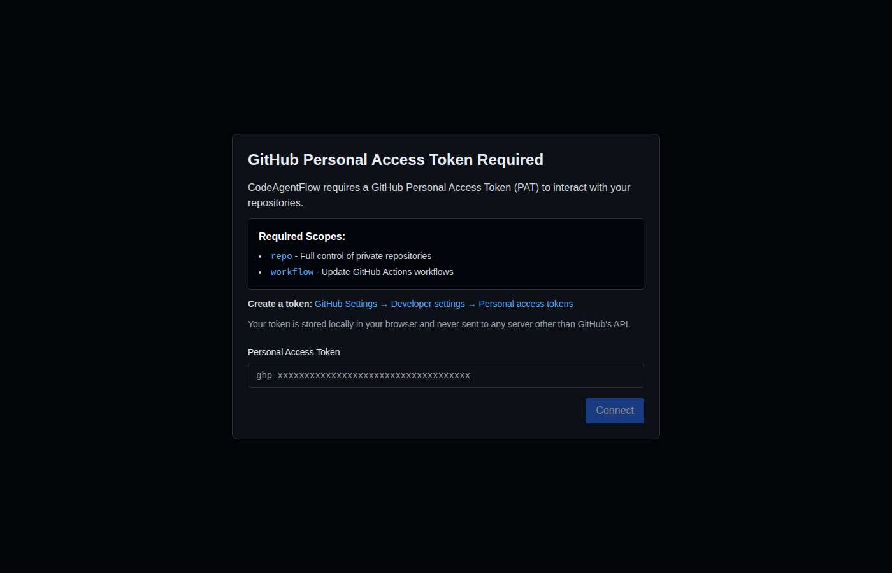
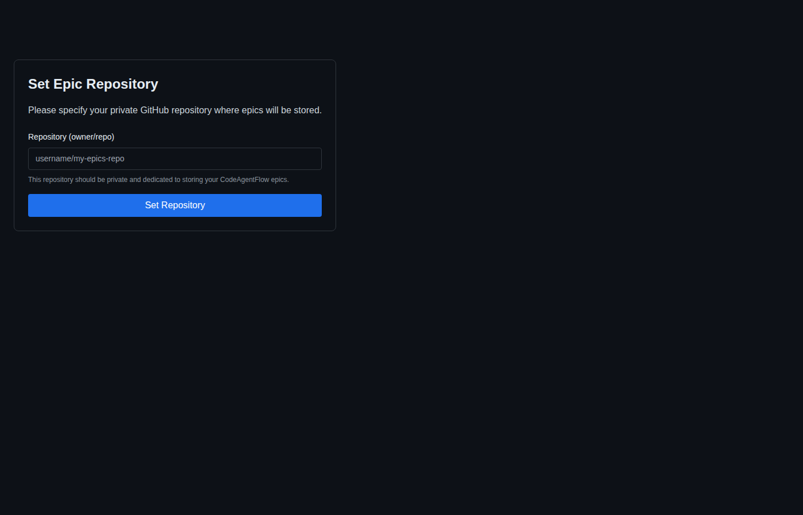
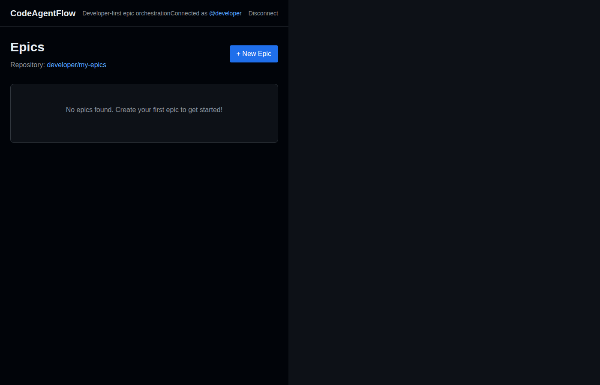
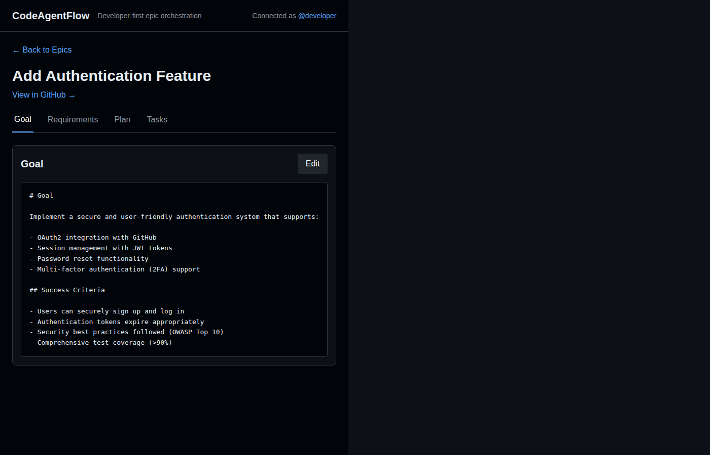

# CodeAgentFlow

A developer-first frontend application for planning and orchestrating long-running work by turning high-level intents into sequences of small, PR-friendly tasks, then driving GitHub Copilot Coding Agent runs to execute them safely over time.

## Screenshots

### Authentication & Setup

<table>
  <tr>
    <td width="50%">
      
      
<em>PAT Authentication Modal</em>

    </td>
    <td width="50%">
      
      
<em>Epic Repository Setup</em>

    </td>
  </tr>
</table>

### Epic Management

<table>
  <tr>
    <td width="50%">
      
      
<em>Epic List Dashboard</em>

    </td>
    <td width="50%">
      
      
<em>Epic Detail View with Markdown Editor</em>

    </td>
  </tr>
</table>

## Features

- **Modern, Developer-First UI** - Clean, IDE-like interface with keyboard-friendly navigation and GitHub deep-links
- **PAT-First Authentication** - Secure GitHub Personal Access Token authentication stored locally in browser
- **Epic Management** - Create and manage epics with goal, requirements, plan, and task breakdown
- **GitHub Integration** - Seamless integration with GitHub repositories for storing epic specifications
- **No Backend Required** - Fully client-side application with no server or database dependencies
- **Testing Included** - Comprehensive unit and end-to-end tests using Vitest and Playwright
