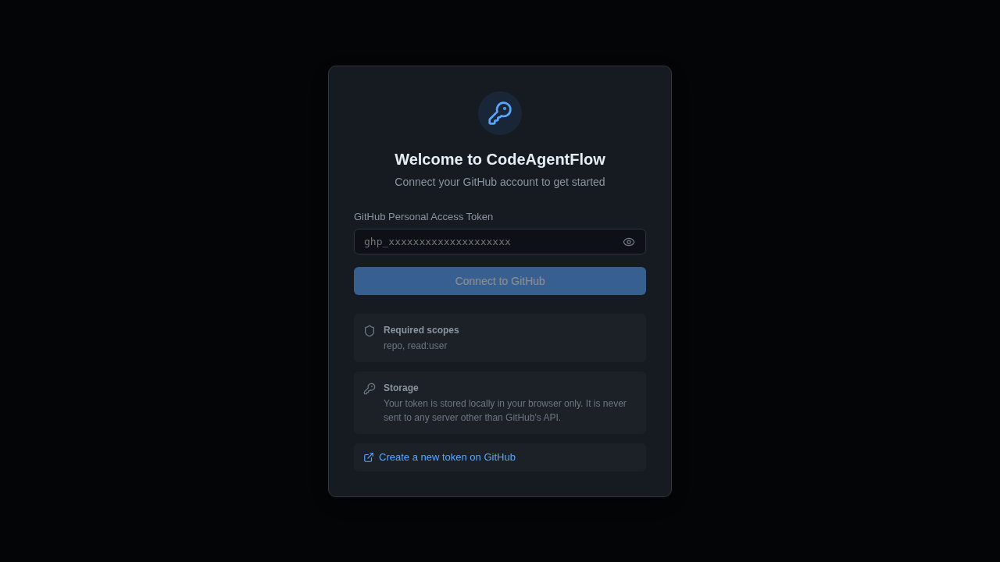
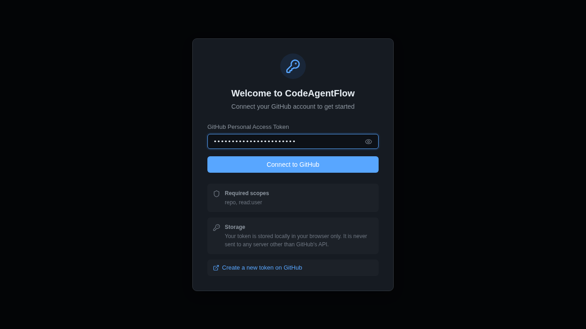
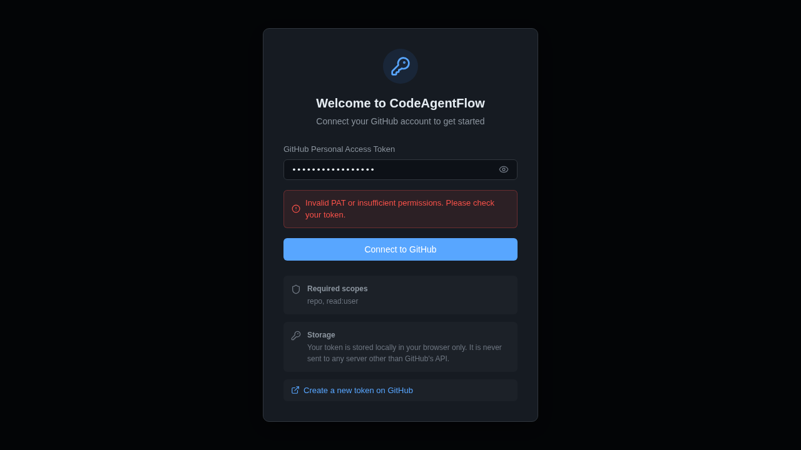

# CodeAgentFlow

A developer-first frontend for planning and orchestrating long-running work by turning high-level intent into a sequence of small, PR-friendly tasks, then driving GitHub Copilot Coding Agent runs to execute them safely over time.

## Features

- **PAT-first login gate** – Modal on first load for GitHub Personal Access Token entry, with scope guidance and local-only storage
- **Epic management** – Create, list, and view epics with goal, requirements, plan, and tasks
- **Epic creation wizard** – Step-by-step flow: Name → Goal → Requirements → Plan → Tasks with subtasks (research & work steps)
- **IDE-like layout** – Sidebar navigation, tabbed epic detail view, keyboard shortcuts
- **GitHub as source of truth** – All epic content stored as Markdown files in a GitHub repo; progress derived from GitHub artifacts
- **Transparency** – Deep-links to GitHub issues, PRs, checks, and Markdown specs
- **Dark theme** – Modern, clean design optimized for developer productivity

## Screenshots

### PAT Login Gate
The app greets new users with a PAT modal that explains required scopes and storage policy.



### Token Entry
Users enter their GitHub Personal Access Token to connect.



### Error Handling
Clear error messages when authentication fails.



## Getting Started

```bash
cd frontend
npm install
npm run dev
```

## Testing

```bash
# Unit tests (Vitest)
npm test

# E2E tests (Playwright)
npm run build
npm run test:e2e
```

## Project Structure

```
frontend/src/
  components/   # React UI components
  hooks/        # Custom React hooks
  services/     # GitHub API client (Octokit)
  types/        # TypeScript type definitions
  utils/        # Utility functions (slugify, templates, storage)
  test/         # Test setup
frontend/e2e/   # Playwright E2E tests
```

## Epic Repo Structure

```
/epics/<epic-name>/
  goal.md
  requirements.md
  plan.md
  /tasks/
    001-<task-slug>.md
    002-<task-slug>.md
```