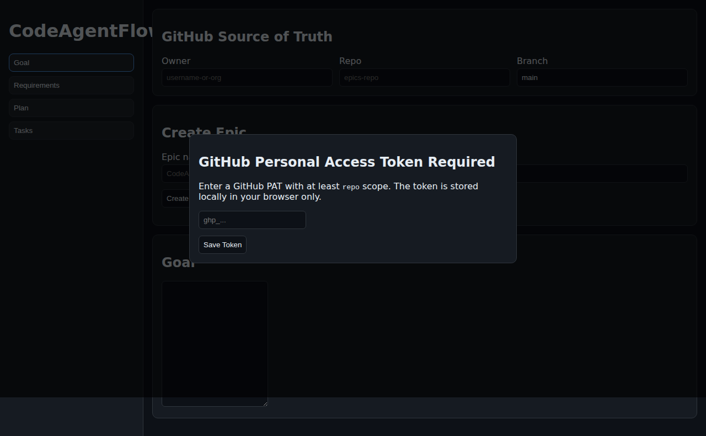
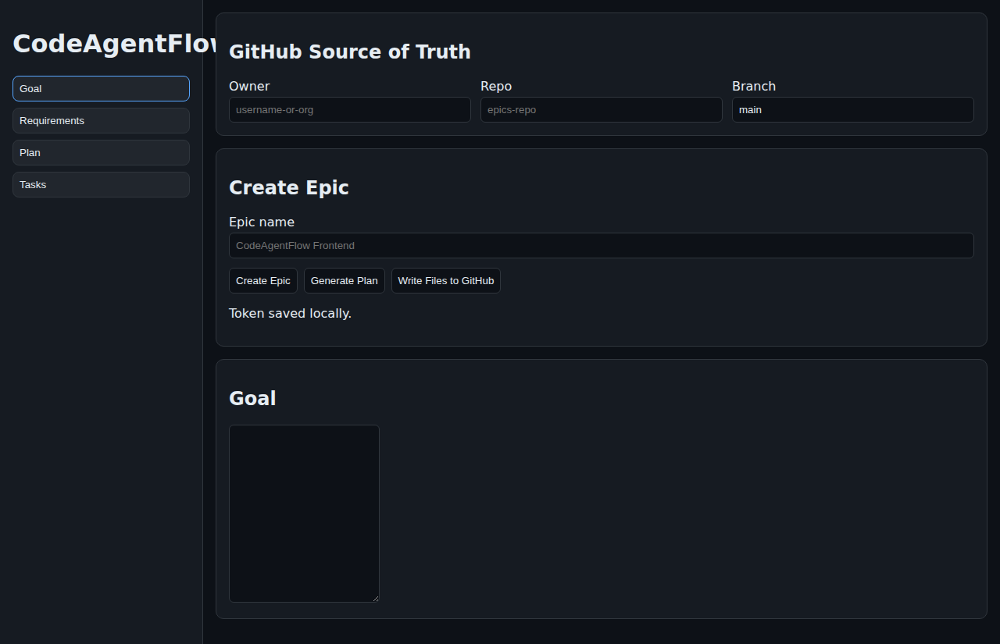

# CideAgentFlow

Frontend prototype for orchestrating Epic planning in GitHub-only workflows.

## Features included

- PAT-first modal gate (stored locally in browser storage)
- Epic scaffolding flow for:
  - `goal.md`
  - `requirements.md`
  - `plan.md`
  - `tasks/*.md`
- GitHub API write flow (no backend, no database)
- Sidebar navigation between Goal / Requirements / Plan / Tasks
- Transparent links back to written GitHub files

## Run locally

```bash
npm install
python3 -m http.server 4173
```

Open `http://127.0.0.1:4173`.

## Tests

```bash
npm test
npm run test:e2e
```

`npm run test:e2e` uses `python3 -m http.server` via Playwright config.

## UI screenshots



