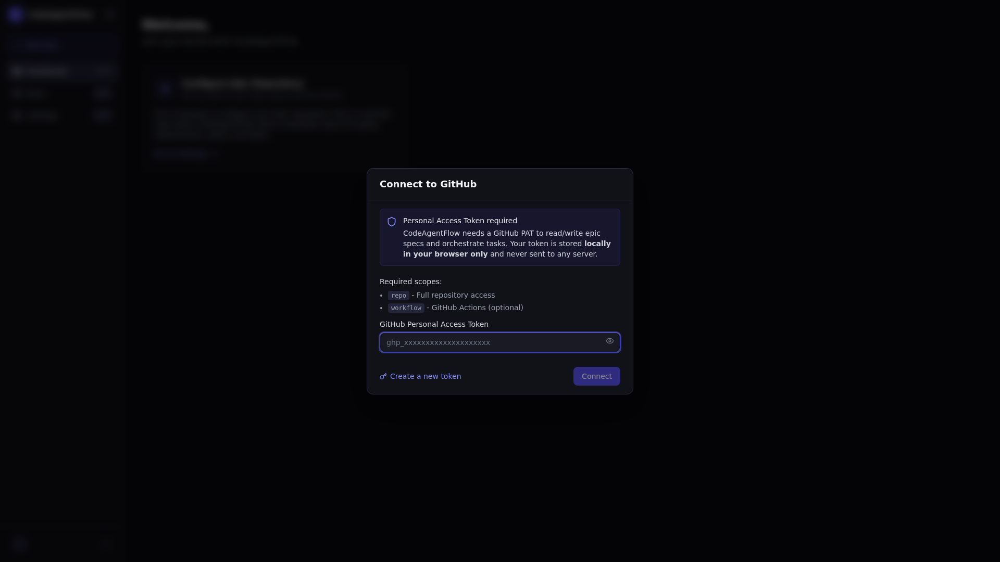
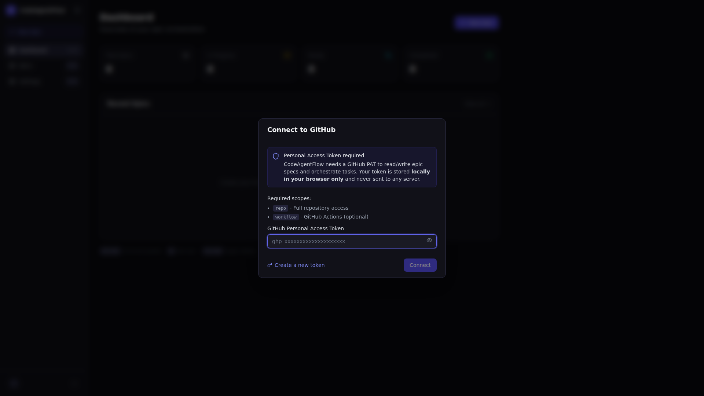
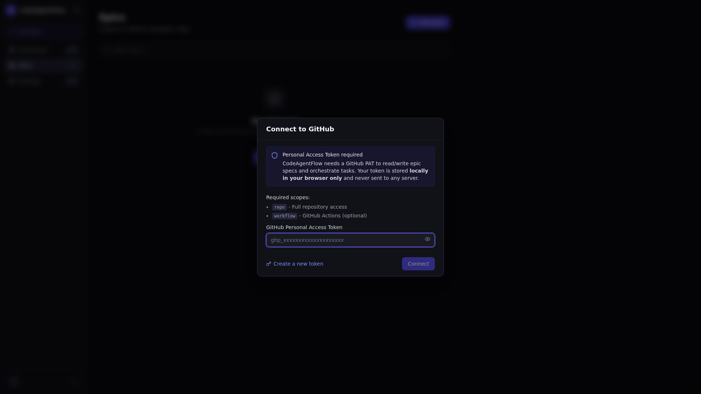
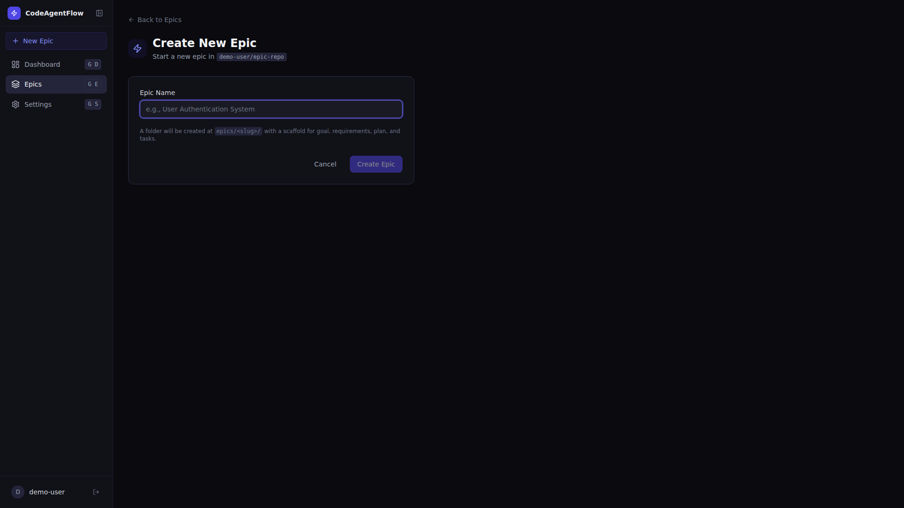
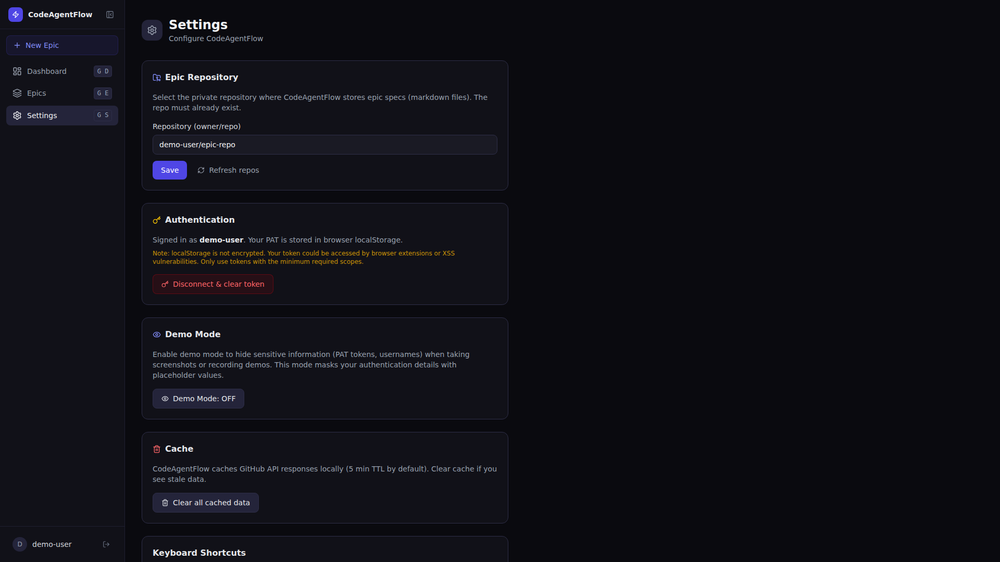

# CodeAgentFlow

A developer-first frontend for planning and orchestrating long-running work by turning high-level intent into a sequence of small, PR-friendly tasks, then driving GitHub Copilot Coding Agent runs to execute them safely over time.


## What it does

CodeAgentFlow breaks large goals into tasks small enough to complete within a single Coding Agent run (e.g., 128k context window), then orchestrates a repeatable loop per task:

**agent-run → validate → fix → merge → next task**

Humans stay in control via manual approval and merge — no autonomous merging.

## Screenshots

### PAT Login Gate
When no GitHub PAT is found, the app shows a modal explaining required scopes and where the token is stored (browser only).



### Dashboard
Overview of all epics with status, task counts, and quick navigation.



### Epic List
Browse all your epics with filtering and sorting options.



### Epic Creation
Create a new epic with a simple guided wizard.



### Settings
Configure your epic repository, manage authentication, and control app preferences.



## Key Features

- **No backend** — All state derived from GitHub (issues, PRs, labels, checks, merges) and Markdown files in a private repo
- **PAT-first authentication** — Token stored locally in browser only
- **Epic workflow** — Guided creation: Goal → Requirements → Plan → Tasks
- **Task orchestration pipeline** — Visual status: Pending → Issue → Agent Running → PR → Review → Merged
- **Keyboard-first navigation** — `Ctrl+K` command palette, `G D`/`G E`/`G S` quick nav, `N` new epic
- **Local caching** — API responses cached with TTL in localStorage
- **GitHub deep-links** — Every artifact links back to the source (issues, PRs, spec files)
- **Markdown editor** — Write specs in Markdown, saved directly to GitHub
- **Extensible** — Architected for future AI features (plan refinement, task sizing, PR summaries)

## Tech Stack

| Layer | Technology |
|-------|-----------|
| Framework | React 19 + TypeScript |
| Build | Vite 7 |
| Styling | Tailwind CSS 4 |
| State | Zustand |
| Routing | React Router 7 |
| GitHub API | Octokit REST |
| Icons | Lucide React |
| Markdown | react-markdown + remark-gfm |
| Unit Tests | Vitest + Testing Library |
| E2E Tests | Playwright |

## Project Structure

```
src/
├── components/
│   ├── layout/          # AppLayout, Sidebar, CommandPalette
│   ├── pat/             # PAT login gate modal
│   └── ui/              # Button, Modal, Badge, Input, TextArea, Spinner, EmptyState
├── hooks/
│   └── useKeyboardShortcuts.ts
├── lib/
│   ├── utils.ts         # slugify, cn, formatDate, status helpers
│   └── markdown.ts      # Generate & parse Markdown for epics/tasks
├── pages/
│   ├── Dashboard.tsx
│   ├── EpicList.tsx
│   ├── EpicCreate.tsx
│   ├── EpicDetail.tsx   # Step-by-step: goal, requirements, plan, tasks
│   ├── TaskDetail.tsx   # Subtasks, pipeline, GitHub links
│   └── Settings.tsx
├── services/
│   ├── github.ts        # Octokit wrapper: files, issues, PRs, repos
│   └── cache.ts         # localStorage cache with TTL
├── stores/
│   ├── auth.ts          # PAT token & validation
│   ├── epic.ts          # Epic CRUD, task loading
│   └── ui.ts            # Sidebar, command palette state
├── types/
│   └── index.ts         # Epic, Task, Subtask, GitHubRepo, etc.
├── App.tsx              # Router + layout + PAT gate
└── main.tsx             # Entry point
```

## Epic Repo Structure

When you create and develop epics, the app writes Markdown files to your private GitHub repo:

```
/epics/<epic-name>/
  goal.md              # What success looks like
  requirements.md      # Constraints, non-goals, acceptance criteria
  plan.md              # Breakdown into agent-sized tasks
  /tasks/
    001-<task-slug>.md  # Individual task specs with subtasks
    002-<task-slug>.md
```

## Getting Started

```bash
# Install dependencies
npm install

# Start dev server
npm run dev

# Run unit tests
npm test

# Run e2e tests (requires Playwright browsers)
npx playwright install chromium
npm run test:e2e

# Build for production
npm run build
```

## Keyboard Shortcuts

| Shortcut | Action |
|----------|--------|
| `Ctrl+K` or `?` | Open command palette |
| `Ctrl+B` | Toggle sidebar |
| `G` then `D` | Go to Dashboard |
| `G` then `E` | Go to Epics |
| `G` then `S` | Go to Settings |
| `N` | Create new Epic |

## Configuration

1. On first visit, enter your GitHub PAT in the login modal
2. Go to **Settings** and select your private Epic repository
3. Start creating epics from the Dashboard or Epics page

### Required PAT Scopes

- `repo` — Full repository access (required)
- `workflow` — GitHub Actions access (optional)

## Testing

### Unit Tests (47 tests)
Tests cover core logic: utility functions, Markdown parsing/generation, and cache service.

```bash
npm test
```

### E2E Tests
Playwright tests cover critical flows: PAT modal display, navigation, and epic creation form.

```bash
npm run test:e2e
```

## License

MIT
