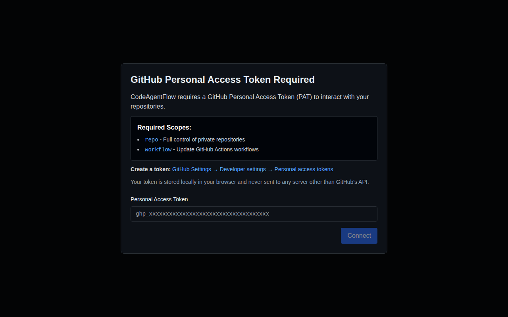

# CodeAgentFlow

A developer-first frontend application for planning and orchestrating long-running work by turning high-level intents into sequences of small, PR-friendly tasks, then driving GitHub Copilot Coding Agent runs to execute them safely over time.



## Features

- **Modern, Developer-First UI** - Clean, IDE-like interface with keyboard-friendly navigation and GitHub deep-links
- **PAT-First Authentication** - Secure GitHub Personal Access Token authentication stored locally in browser
- **Epic Management** - Create and manage epics with goal, requirements, plan, and task breakdown
- **GitHub Integration** - Seamless integration with GitHub repositories for storing epic specifications
- **No Backend Required** - Fully client-side application with no server or database dependencies
- **Testing Included** - Comprehensive unit and end-to-end tests using Vitest and Playwright

## Quick Start

### Prerequisites

- Node.js 18+ and npm
- A GitHub Personal Access Token with the following scopes:
  - `repo` - Full control of private repositories
  - `workflow` - Update GitHub Actions workflows

### Installation

```bash
# Install dependencies
npm install

# Run development server
npm run dev

# Build for production
npm run build

# Preview production build
npm run preview
```

### Running Tests

```bash
# Run unit tests
npm test

# Run unit tests in watch mode
npm run test

# Run e2e tests
npm run test:e2e

# Run e2e tests with UI
npm run test:e2e:ui
```

## Project Structure

```
/
├── src/
│   ├── components/         # React components
│   │   ├── PATModal.tsx   # GitHub token authentication modal
│   │   ├── EpicList.tsx   # Epic list and creation
│   │   └── EpicDetail.tsx # Epic detail view with tabs
│   ├── contexts/          # React contexts
│   │   └── AppContext.tsx # Global app state management
│   ├── services/          # Core services
│   │   ├── storage.ts     # Browser localStorage service
│   │   ├── github.ts      # GitHub API client
│   │   └── epic.ts        # Epic repository service
│   ├── test/              # Test utilities
│   │   └── setup.ts       # Vitest setup
│   ├── App.tsx            # Main app component with routing
│   ├── main.tsx           # Application entry point
│   └── index.css          # Global styles with Tailwind
├── e2e/                   # Playwright end-to-end tests
├── dist/                  # Production build output
└── index.html             # HTML entry point
```

## How It Works

### Epic Repository Structure

CodeAgentFlow uses a dedicated GitHub repository (you specify during setup) to store all epic specifications. Each epic is organized as:

```
/epics/
  /<epic-name>/
    goal.md           # What success looks like
    requirements.md   # Constraints, non-goals, acceptance criteria
    plan.md          # Task breakdown
    /tasks/
      001-<task>.md  # Individual task specifications
      002-<task>.md
      ...
```

### Authentication Flow

1. On first load, if no GitHub PAT is found, a modal prompts the user
2. User provides their PAT, which is validated against GitHub's API
3. Token is stored securely in browser localStorage (never sent to any server except GitHub)
4. User can disconnect at any time, clearing all stored data

### Epic Creation Flow

1. User specifies an epic repository (owner/repo format)
2. Creates a new epic with a name
3. App scaffolds the epic folder structure in the repository
4. User edits goal, requirements, and plan using the built-in editor
5. User creates tasks within the epic

### State Management

- **No Backend**: All data comes directly from GitHub via the Octokit API
- **Local Caching**: Browser storage used only for caching directory listings and UI state (with TTL)
- **GitHub as Source of Truth**: Epic content and execution state derived from GitHub artifacts

## Architecture

### Core Services

#### Storage Service (`src/services/storage.ts`)
- Manages browser localStorage for PAT, epic repo, and cached data
- Implements TTL-based caching for performance
- Never used as source of truth for epic content

#### GitHub Client (`src/services/github.ts`)
- Wraps Octokit REST API with typed interfaces
- Handles file operations (read, write, list)
- Manages issues and pull requests
- Validates tokens and scopes

#### Epic Service (`src/services/epic.ts`)
- High-level API for epic management
- Scaffolds epic folder structures
- Parses and manages epic Markdown files
- Handles task creation and organization

### UI Components

- **PATModal**: First-run authentication with scope explanation
- **EpicList**: Dashboard showing all epics with creation flow
- **EpicDetail**: Tabbed interface for goal, requirements, plan, and tasks

### Context & State

- **AppContext**: Global state for authentication, GitHub client, and epic service
- React hooks for accessing and updating app state
- Automatic token validation on mount

## Technology Stack

- **React 18** - UI framework
- **TypeScript** - Type safety
- **Vite** - Build tool and dev server
- **Tailwind CSS** - Utility-first styling
- **React Router** - Client-side routing
- **Octokit** - GitHub API client
- **Vitest** - Unit testing
- **Playwright** - End-to-end testing

## Development

### Adding New Features

The application is designed to be extensible for additional AI capabilities:

1. Add new services in `src/services/`
2. Create new components in `src/components/`
3. Extend context in `src/contexts/AppContext.tsx`
4. Add routes in `src/App.tsx`

### Testing Guidelines

- Write unit tests for all services and utilities
- Add component tests for complex UI logic
- Create e2e tests for critical user flows
- Maintain test coverage above 80%

### Code Style

- Use TypeScript for all new files
- Follow existing component patterns
- Keep components focused and single-purpose
- Use Tailwind utility classes for styling
- Add JSDoc comments for public APIs

## Deployment

Build the application for production:

```bash
npm run build
```

The `dist/` folder contains the production-ready static files. Deploy to any static hosting service:

- GitHub Pages
- Netlify
- Vercel
- AWS S3 + CloudFront
- Any static web server

### Environment Configuration

No environment variables needed - the app is fully client-side and configured through the UI.

## Security

- GitHub PAT stored only in browser localStorage
- Token never sent to any server except GitHub's API
- No backend means no server-side attack surface
- User has full control over stored data

## Contributing

1. Fork the repository
2. Create a feature branch
3. Make your changes with tests
4. Run linter and tests
5. Submit a pull request

## License

MIT License - see LICENSE file for details

## Support

For issues, questions, or contributions, please open an issue on GitHub.

---

**Note**: This application requires a GitHub Personal Access Token with appropriate scopes. Never share your token or commit it to version control.
